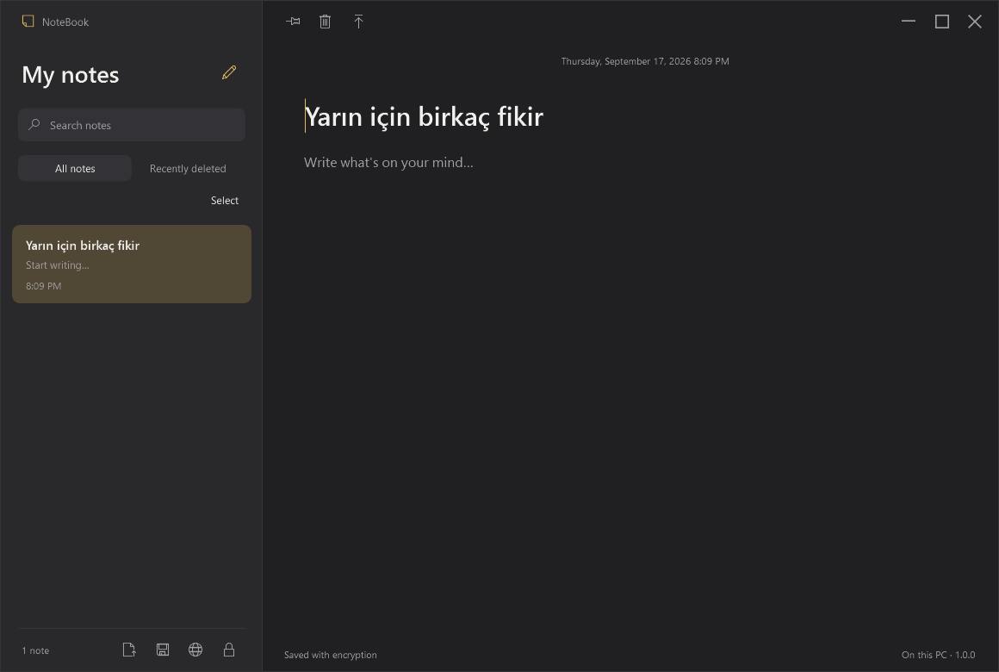
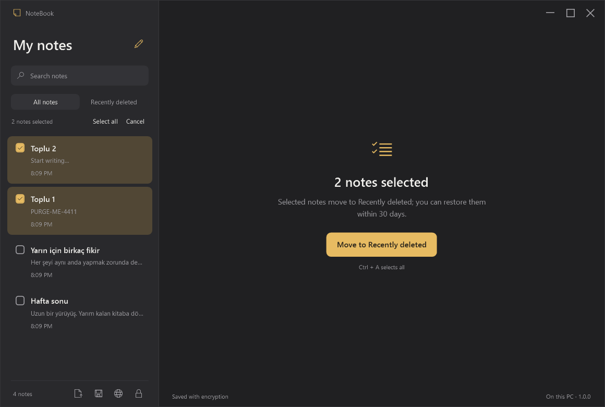
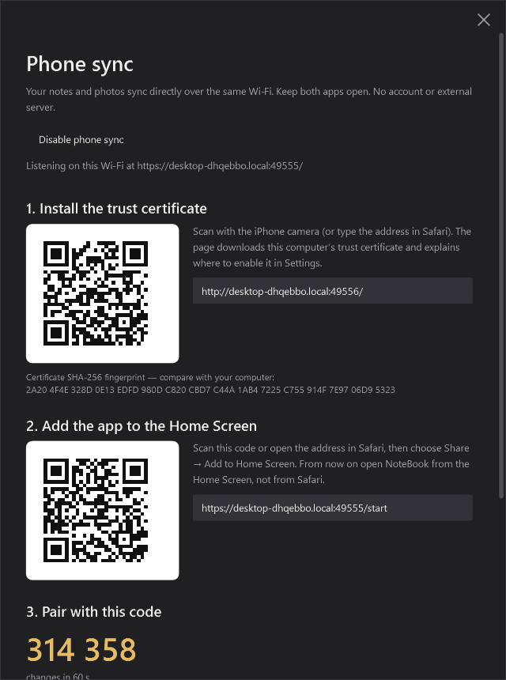
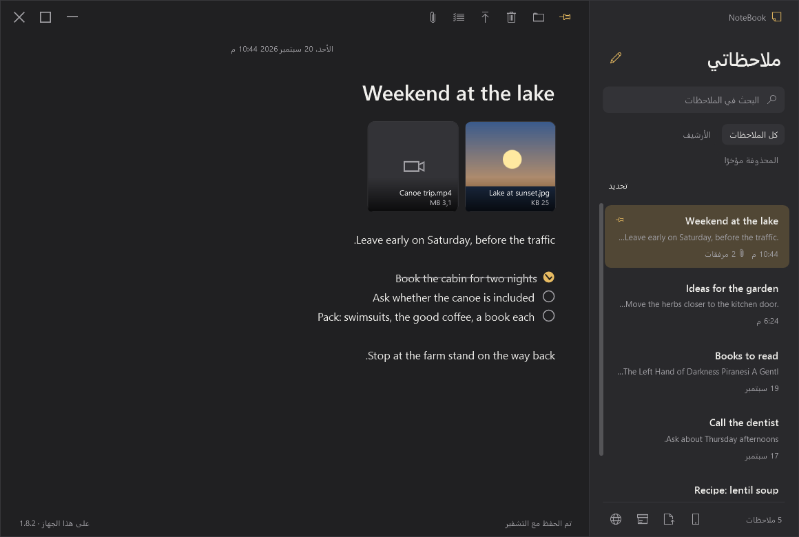

# NoteBook (Notlar)

An Apple Notes–style notebook for Windows with a matching iPhone app that syncs over your own Wi‑Fi. Everything is encrypted, nothing leaves your devices, and there is no account, no cloud and nothing to pay for.

[](https://github.com/Obirize/NoteBook/releases/latest)
[](https://github.com/Obirize/NoteBook/releases)
[](LICENSE)


**[⬇ Download the latest installer](https://github.com/Obirize/NoteBook/releases/latest)** · [Türkçe](README.tr.md)



## What it does

- **Notes** with a title, text, checklists, photos and videos. Search, pin, multi-select, an *Archive* for notes you want out of the way, a 30‑day *Recently deleted* folder, opens TXT, Markdown, HTML, RTF and Word files as notes and saves notes as TXT or Markdown, 13 interface languages on both the PC and the phone.
- **Encrypted at rest.** Notes are stored in a vault sealed with AES‑256‑GCM; every photo and video is a separate file encrypted with its own key. On the PC the keys are protected by your Windows sign‑in, so the app never asks for a password.
- **iPhone sync without a server.** The Windows app itself serves a small web app to your phone; you add it to the Home Screen and pair with a six‑digit code. Notes and files then sync directly between the two devices whenever both are on the same Wi‑Fi. The phone app looks like Apple Notes and works offline.
- **Runs in the background.** Closing the window keeps NoteBook in the notification area so the phone can sync; the installer can start it with Windows.
- **Backups you own.** A password‑protected backup opens on any PC; restoring merges instead of overwriting.
- **Updates from GitHub Releases** — the only thing the app ever talks to outside your network.

<p align="center"> </p>

## Install

Download `NoteBook-Setup-<version>.exe` from [Releases](https://github.com/Obirize/NoteBook/releases). The installer is per‑user (no administrator rights), installs to `%LocalAppData%\Programs\NoteBook`, keeps your notes in `…\NoteBook\data` and never deletes them on uninstall. It offers a desktop shortcut, *Open with* for `.txt`, `.md`, `.markdown`, `.text` and `.log` files, a *New note* entry in the right‑click menu and *Start with Windows*.

The installer is not code‑signed yet, so the first download may show a SmartScreen prompt ("More info → Run anyway"). In‑app updates do not.

Portable use also works: unzip, keep `Not Defteri.exe` next to the `app` folder; notes live in `data` beside them.

## Phone (iPhone)

Open the phone window with the phone button at the bottom left of the sidebar. It walks through three steps, each with a QR code:

1. **Trust certificate.** The PC is its own certificate authority. The first code opens a page that downloads a profile; install it under *Settings → General → VPN & Device Management*, then switch it on under *Settings → General → About → Certificate Trust Settings*. The page has a *Test the connection* button that tells you when this is done. The fingerprint is shown on both sides so you can compare.
2. **Home Screen app.** The second code opens the app in Safari, which explains the two taps: *Share → Add to Home Screen*. From then on, open NoteBook from the Home Screen (iOS gives Home Screen apps their own storage).
3. **Pairing code.** In the Home Screen app tap *Pair* and type the six‑digit code shown on the PC. A new code appears every minute and codes only exist while that window is open.

Afterwards the phone syncs whenever it is on the home Wi‑Fi and the PC app is running (even hidden in the tray). Away from home the phone keeps working offline and merges when it is back. Photos and videos are never re‑encoded; the app asks iOS for the originals. In a note they sit in a grid of tiles (a video shows its first frame: whichever side can decode the file makes a small picture once and it travels with the note, so an iPhone HEVC clip the PC cannot play still gets a preview there); tapping one opens a viewer with *save or share* (the share sheet's *Save Image / Save Video* puts it in Photos) and *remove*. The note's *…* menu offers *Select Photos and Videos* — tick the ones you want, then *Save (n)* sends them to the share sheet together or *Remove (n)* takes them off the note — and *Save all*. The share button at the top shares the whole note (text plus its media). On the PC, hovering a tile shows a check circle (Ctrl+click or Space works too); with tiles checked, a bar offers *Save selected…* and *Remove selected*, and *Save all attachments…* (right-click a note card or an attachment) writes every file of a note, or of all checked notes, into a folder.

The note screen follows the Notes app: back, share and *…* at the top; checklist, camera, pin and new note along the bottom, with the bar riding above the keyboard while you type.

## How the link stays up

The phone never trusts a connection it cannot hear. Every attempt is bounded (10 s to open, 25 s to be welcomed); while the app is on screen it sends a small "are you there?" every 20 s, and when you come back to the app after a pause it asks once more and, if nothing answers within 4 s, opens a new connection by itself (after 45 s away it does not even ask). A 5‑second tick notices a suspended page even when iOS delivers no event. The PC is tried by name and, three seconds later, by address; whichever answered last is tried first next time. On the PC a phone that has been silent for a minute is dropped, the same phone coming back replaces its old session, and every session's end is written to a dated log (`data/sync/sync-log.txt`, also shown in the sync window with a *Copy log* button) together with what the phone reports about its previous link ("hidden 28800 s, prev no-pong"). The PC's certificate follows its addresses and renews itself while the app runs; the phone's profile never changes.

## When the phone will not connect

The sync window on the PC has a dated **Recent connections** list: whether the phone reaches the PC at all, which name or address it used, whether it accepted the certificate, why a session ended, and why a pairing code was refused. Two quick checks on the phone, in Safari:

- `http://<pc>.local:47832/` (the address under step 1; the window also shows an IP form such as `http://192.168.1.8:47832/`). If this does not open, the phone cannot reach the PC on the network: same Wi‑Fi name, and the router's "client isolation" / "AP isolation" must be off.
- `https://<pc>.local:47831/start`. If the first address opens but this one does not, the phone no longer trusts the PC's certificate — the PC also warns about this after a few failed attempts. On the phone: Settings → General → About → Certificate Trust Settings → turn on the NoteBook certificate (if it is missing, repeat step 1). This can happen after an iOS update or when the profile is removed; it does not happen on a normal restart.

If the app on the Home Screen shows a broken or empty screen after a PC update, it drops its offline copy and reloads itself once; if that still fails, remove the icon and add it again from `/start`.

## Shortcuts (Windows)

| Shortcut | Action |
| --- | --- |
| Ctrl+N | New note |
| Ctrl+O | Open text files (TXT, Markdown, HTML, RTF, DOCX, …) as new notes |
| Ctrl+Shift+A | Add photos or videos to the open note |
| Ctrl+Shift+L | Turn the current line (or the selected lines) into checklist items, and back |
| Ctrl+E | Archive the open or checked notes, or bring them back from the archive |
| Ctrl+V | Paste a picture or media files from the clipboard as attachments |
| Ctrl+Shift+S | Save the open note as an unencrypted TXT or Markdown copy |
| Ctrl+K / Ctrl+F | Search |
| Ctrl+S | Save now / retry a failed save |
| Ctrl+Z / Ctrl+Y | Undo / redo text edits |
| Delete (outside a text box) | Move the open or checked notes to Recently deleted; there, delete permanently (asks first) |
| Shift+Delete | Delete permanently (asks first) |
| Ctrl+A (select mode) | Select all |
| Esc | Leave select mode |

## How the encryption works

**On the PC.** Notes, titles and dates are encrypted with AES‑256‑GCM. A random 256‑bit content key is wrapped with Windows DPAPI (`CurrentUser`) and stored in the vault; every save uses a fresh nonce and any tampering fails authentication. Each attachment is written to `data/attachments/<id>.bin` in 1 MB AES‑256‑GCM chunks under its own random key; the key and metadata live only inside the encrypted notebook, and every chunk authenticates the file header, the attachment id, its index and a "last chunk" flag, so files cannot be truncated, reordered or swapped. Playing a video hands the player a decrypted copy in the temp folder that is deleted when the viewer closes.

There is no separate application password or idle lock: your Windows sign‑in protects the notes. The goal is that **someone who copies the files alone cannot read them**. A program running under the same Windows account, or a person at your unlocked session, can open the notes; this is not a defense against malware with administrator rights, keyloggers or memory dumps.

**Between the devices.** The phone and the PC share a 256‑bit sync key that travels once, over TLS, in exchange for the pairing code. From it both derive an authentication key (a mutual HMAC challenge on every connection) and a content key (AES‑256‑GCM). Every note travels and is stored on the phone as ciphertext under that content key; attachments travel as the already encrypted files, byte for byte. The server listens on TCP 47831 (HTTPS + WebSocket) and 47832 (the plain setup page that hands out the certificate), answers only addresses on the local network and talks only to devices that prove the key. Merging keeps the higher revision of a note; if both devices edited the same revision, the newer one stays and the other is kept as a "conflict copy". Permanent deletions are remembered for 180 days so a phone cannot bring a purged note back.

References: [DataProtectionScope](https://learn.microsoft.com/en-us/dotnet/api/system.security.cryptography.dataprotectionscope), [AesGcm](https://learn.microsoft.com/en-us/dotnet/api/system.security.cryptography.aesgcm). No telemetry. Not independently audited.

## Archive

The folder row above the list has three entries: *All notes*, *Archive* and *Recently deleted*. The folder button in the note toolbar (Ctrl+E), the card's right‑click menu or the bulk bar in select mode moves notes into the archive; the same control in the archive brings them back. Archived notes stay editable and searchable inside the archive, sync to the phone like any other change, and never expire. On the phone the app opens like Notes: a *Folders* screen (*Notes*, *Archive*, *Recently deleted* with their counts) leads to a list that is one card of rows, the note count in the bottom bar (or what the link is doing until the notes are up to date), and a swipe on a row that reveals share, move and delete (restore and delete for good in the trash) — a long swipe fires the last one. The "…" menu holds *Select Notes*, *Sync now* and *Pair again*; the trash has *Edit* instead. Restoring a note from *Recently deleted* always puts it back in *All notes*.

## Checklists

The checklist button (Ctrl+Shift+L on the PC, the list icon on the phone) turns the current line into an item with a round check box; Enter continues the list, Enter on an empty item ends it, Backspace at the start of an item turns it back into text, and tapping the circle marks it done (struck through). Items are stored as plain lines starting with `○` or `●`, so they sync, search and export like any other text.

## Opening and saving text files

Ctrl+O, the *Open a text file* menu entry, drag‑and‑drop onto the window or *Open with* in Explorer turn a file into a new note (several files at once become several notes). The original file is never touched. Supported:

| Kind | Extensions | What becomes the note |
|---|---|---|
| Plain text | `.txt` `.text` `.log` `.json` `.csv` `.tsv` `.xml` `.ini` `.cfg` `.conf` `.yaml` `.yml` `.nfo` | The text as it is; UTF‑8, UTF‑16/32 with BOM, or the Windows‑1254 code page that old Notepad files use |
| Markdown | `.md` `.markdown` | The text; `- [ ]` / `- [x]` task lists become checklists |
| HTML | `.html` `.htm` | The readable text without tags, scripts and styles |
| Rich text / Word | `.rtf` `.docx` | The text without formatting, images or tables |

Files over 8 MB and files that are not text are refused. Ctrl+Shift+S saves the open note as an unencrypted copy: **TXT** (the text exactly as written) or **Markdown** (the title as a `#` heading, checklists as task lists). Saving is limited to text extensions, so a note can never be written over a vault or a backup.

## Files, backup and recovery

- `data/notes.vault` — the encrypted notebook; `data/notes.vault.bak` — the previous save.
- `data/attachments/` — encrypted photos and videos, one file per attachment.
- `data/sync/` — the certificates and the sync key (DPAPI‑protected) plus the list of paired phones.
- `data/settings.json` — language and small preferences.

**Backup** (the box icon in the sidebar) → *Create backup…* writes a `.vault` file protected by a password you choose (PBKDF2 600k + AES‑256‑GCM); with attachments, a `<name>.vault.files` folder is written beside it — keep the two together. It opens on any PC with that password. *Restore from backup…* merges: notes missing locally are added, the newer revision of each note wins, files that are missing are copied, nothing is removed.

If the main file cannot be opened, the app offers the previous save; damaged files are kept as `.damaged-…`, never silently replaced. Notes in Recently deleted are purged after 30 days together with their attachment files.

## Languages

The Windows app follows the Windows display language and offers 13 languages from the globe button: English, Türkçe, Español, 中文, हिन्दी, العربية (right‑to‑left), Português, Русский, 日本語, Deutsch, Français, Bahasa Indonesia, 한국어. Strings live in `src/Notlar/Languages/<code>.json`; the test run verifies that every language has every key. The phone app follows the phone's language with the same 13 (`src/Notlar/Web/lang.js`).

<p align="center"></p>

## Development

Windows and the .NET 10 SDK; Node.js for the phone test. No third‑party packages: the HTTPS/WebSocket server, the certificate authority and the QR encoder are part of the source.

- `src/Notlar/` — the WPF app. `Web/link.js` is the phone's connection state machine (pure, tested under node with a fake clock). The main window is split by concern (`MainWindow.List.cs`, `.Editor.cs`, `.Attachments.cs`, `.Files.cs`, `.Sync.cs`, `.Tray.cs`); `Sync/` holds the server, sessions, protocol, certificates and QR code; `Web/` holds the phone app as small ES modules (`state`, `ui`, `store`, `sync`, `list`, `editor`, `attachments`; vanilla JavaScript, WebCrypto, IndexedDB). Files stay under about 300 lines on purpose.
- `build.cmd` — publishes a self‑contained x64 build to `app/` and compiles the root launcher.
- `test.cmd` — runs the checks with temporary data (`NOTLAR_SHOT=docs` also regenerates the screenshots in this README from sample notes): encryption and tamper detection, attachments, backups, trash policy, bulk actions, tray behaviour, UI layout, and a Node script that plays the phone (pairing code, sync in both directions, conflicts, byte‑identical files).
- `build-setup.cmd` — builds the installer with [Inno Setup 6](https://jrsoftware.org/isdl.php) into `dist/`.

Releasing: push a version tag and `.github/workflows/release.yml` builds the installer, writes its `.sha256` and attaches both to a GitHub Release; running apps offer it within a few hours.

```bash
git tag v1.6.0
git push --tags
```

## Roadmap

- Android (the same web app in Chrome; the certificate step differs).
- Sync away from home — today the phone syncs on the home Wi‑Fi; the options are your own WireGuard on the PC, or a transport‑only relay that cannot read anything.
- Code signing for the installer.

## License

MIT — see [LICENSE](LICENSE).
